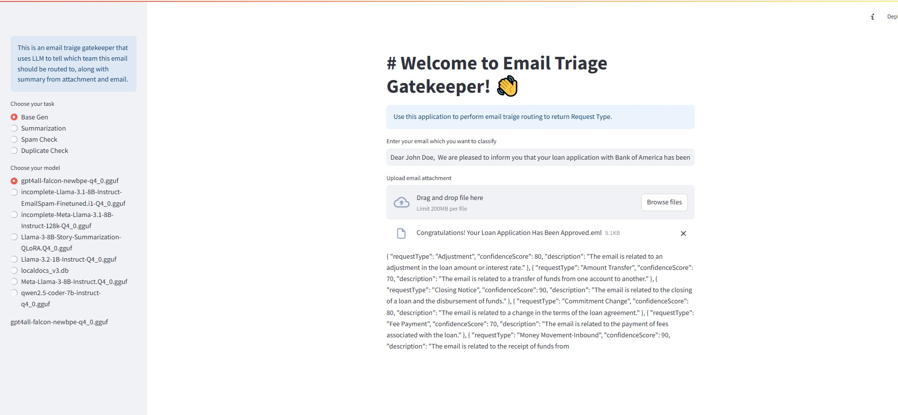
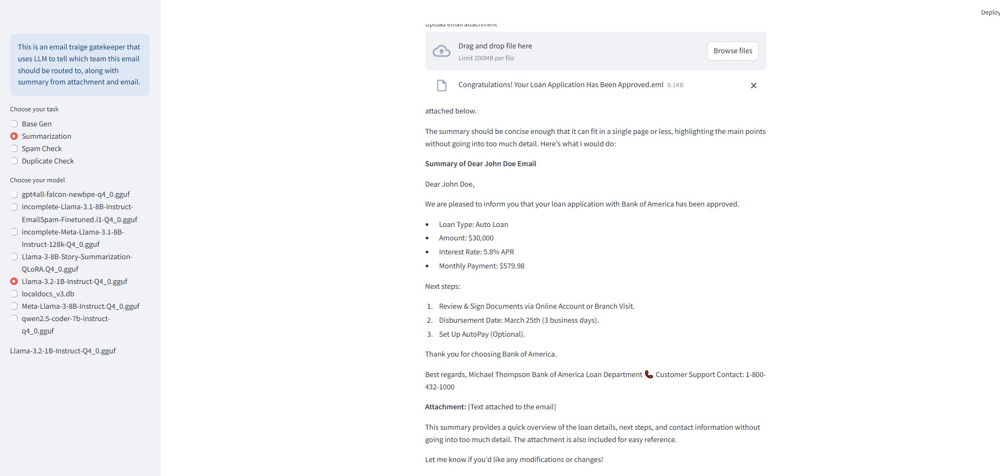
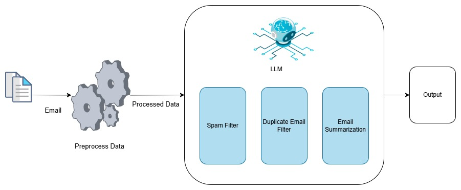
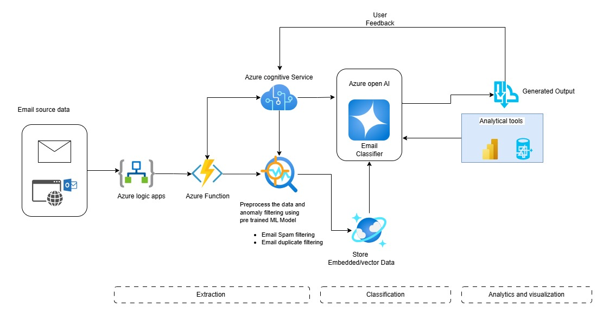

# 🚀 Gen AI-Based Email Classification and OCR

## 📌 Table of Contents
- [Introduction](#introduction)
- [Demo](#demo)
- [Inspiration](#inspiration)
- [What It Does](#what-it-does)
- [How We Built It](#how-we-built-it)
- [Challenges We Faced](#challenges-we-faced)
- [Folder Structure](#folder-structure)
- [How to Run](#how-to-run)
- [Future Enhancements](#future-enhancements)
- [Tech Stack](#tech-stack)
- [Team](#team)
- [Acknowledgments](#acknowledgments)

---

## 🎯 Introduction
Commercial Bank Lending Service teams receive a high volume of servicing requests via email. These emails contain diverse requests, often with attachments, which need to be processed and ingested into the loan servicing platform. Currently, manual processing is time-consuming, error-prone, and inefficient.

This project leverages Generative AI (LLMs) with LangChain to automate email classification and data extraction, improving efficiency, accuracy, and turnaround time in loan servicing.

## 🎥 Demo
🔗 [Live Demo](#) (if applicable)  
📹 [Video Demo](#) (if applicable)  
🖼️ Screenshots:




## 💡 Inspiration
- Financial institutions handle thousands of service requests daily, leading to inefficiencies due to manual classification.

- Traditional rule-based automation solutions lack the flexibility to handle diverse email structures and attachments.

- With recent advancements in Large Language Models (LLMs), we aim to leverage AI for intelligent email processing to enhance operational efficiency.

## ⚙️ What It Does
1. Email Classification: Categorizes incoming loan service requests into predefined classes (e.g., Loan Modification, Payment Inquiry, Document Request, etc.).

2. Data Extraction: Extracts relevant entities such as loan numbers, customer details, payment amounts, and key dates from both email bodies and attachments.

3. Intelligent Processing Pipeline:
   - Uses LangChain to integrate multiple LLMs (LLaMA, Falcon, DeepSeek).

   - Applies different model configurations (1B, 3B, 8B) for performance comparison.

   - Parses email content & attachments (PDF, DOCX, XLSX, etc.).

   - Automates structured data ingestion into the Loan Servicing Platform.

4. Improved Accuracy & Efficiency:

   - Reduces manual workload.

   - Enhances data extraction precision.

   - Speeds up turnaround time significantly.

## 🛠️ How We Built It
- Programming Language: Python

- Frameworks & Libraries:

   - LangChain for LLM orchestration

   - LLMs (LLaMA, Falcon, DeepSeek - 1B, 3B, 8B models)

   - PyPDF2, re for document processing

   - Spam Detection : Spam ML Model and NLTK

   - Streamlit for UI and API integration
 - System Design:

 
   -  


## 🚧 Challenges We Faced
- Handling Unstructured Data: Emails vary in format, making entity extraction challenging.

- Model Selection & Optimization: Balancing accuracy, cost, and speed across different LLMs.

- Attachment Processing: Extracting data from scanned PDFs and complex tables.

- Latency & Performance: Optimizing LLM inference to meet real-time processing requirements.

- Integrating Multi-Modal Data: Handling both text and document-based content effectively.

## Folder Structure
📦 gaied-gen-x-y-zn/code/src
├── 📂 data                    # Sample email data & attachments
├── 📂 lib                     # Email parsing & processing scripts
├── 📂 Utils                   # Utility methods
├── 📜 app-comparison.py       # Main Application
├── 📜 llm.py                  # LLM configurations & code
├── 📜 README.md               # Project Documentation
├── 📜 requirements.txt        # Dependencies


## 🏃 How to Run
1. Clone the repository  
   ```sh
   git clone https://github.com/ewfx/gaied-gen-x-y-z.git
   ```
2. Create a virtual environment
   ```sh
   python3 -m venv venv
   source venv/bin/activate  # On Windows: venv\Scripts\activate
   ```
3. Install dependencies  
   ```sh
   pip install -r requirements.txt
   ```
4. Install the GPT4All Installer using GUI based installers
   - Windows: https://gpt4all.io/installers/gpt4all-installer-win64.exe
   - Mac: https://gpt4all.io/installers/gpt4all-installer-darwin.dmg
   - Ubuntu: https://gpt4all.io/installers/gpt4all-installer-linux.run

5. Download the required LLM models and take note of the PATH they're installed to
6. Update the path of the models in app-comparison.py & llm.py & app-main.py
7. Run the project  
   ```sh
   streamlit run app-comparison.py
   ```

## 📌 Future Enhancements

   - Implement fine-tuning on domain-specific data.

   - Integrate retrieval-augmented generation (RAG) for better contextual understanding.

   - Deploy on Azure/AWS/GCP for scalable processing.
   - 

## 🏗️ Tech Stack
- 🔹 Frontend: Streamlit
- 🔹 Backend: Streamlit
- 🔹 Other: Langchain / GPT4All


## 👥 Team
- **Aditya Mangla** - [GitHub](https://github.com/aadimangla) | [LinkedIn](https://www.linkedin.com/in/aadimangla/)
- **Richa Gupta** - [GitHub](#) | [LinkedIn](#)
- **Ahmed Kavish Rizvi** - [GitHub](https://github.com/uchiharizvi) | [LinkedIn](https://www.linkedin.com/in/kavishrizvi)
- **Nalini V.** - [GitHub](#) | [LinkedIn](#)

## 🌟 Acknowledgments
   - Thanks to Wells Fargo Hackathon Organizers for this challenge.
   - Inspired by advances in LLM-based document processing.
   - Shoutout to OpenAI, Hugging Face, LangChain for powerful AI tools!
